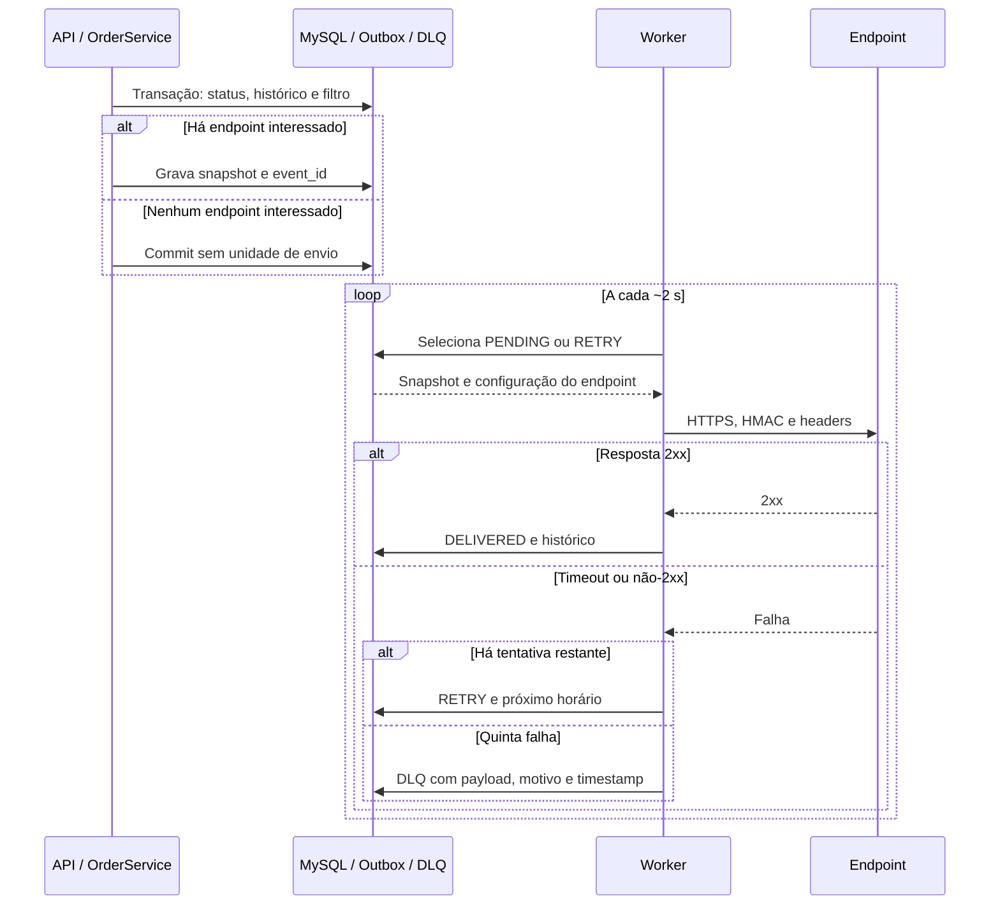
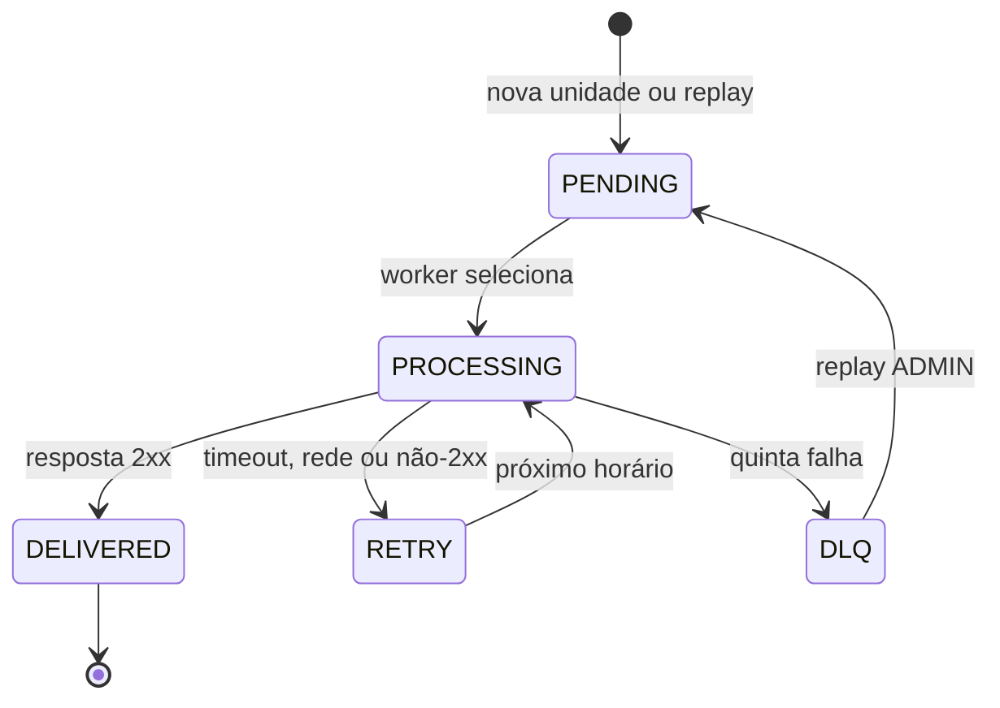

# FDD — Webhooks outbound para mudanças de status de pedidos

> **Natureza do documento:** especificação de design para implementação futura. Os contratos, nomes de estados e status HTTP marcados como **propostos** não são decisões literais da reunião e devem passar por revisão antes do código.

## 1. Contexto e motivação técnica

Atlas Comercial, MaxDistribuição e Nova Cargo consultam `GET /orders` repetidamente para descobrir mudanças de status. Esse polling é lento e caro para os clientes, e a Atlas sinalizou risco de migração caso a capacidade não seja entregue até o fim do trimestre. A meta operacional aceita na reunião é notificar a mudança em menos de 10 segundos no cenário normal.

O código atual altera o pedido, registra `OrderStatusHistory` e ajusta estoque dentro de uma transação Prisma. A reunião decidiu que a plataforma não deve fazer HTTP síncrono dentro dessa transação. O evento outbound será registrado em uma Outbox no MySQL na mesma transação, e um worker separado fará a entrega posterior.

O FDD transforma essa decisão em um desenho auditável contra a transcrição e contra o clone atual. A implementação de modelos, rotas, worker, testes e dependências novas não está incluída nesta fase.

## 2. Objetivos técnicos

- Registrar um evento somente quando a mudança do pedido for confirmada, sem perder o evento entre o commit e o envio.
- Evitar que a disponibilidade ou lentidão de um endpoint externo bloqueie a mudança de status de pedidos.
- Entregar o evento por processo separado, com polling de 2 segundos, timeout de 10 segundos e cinco tentativas com backoff de 1 minuto, 5 minutos, 30 minutos, 2 horas e 12 horas.
- Preservar um snapshot do payload e um UUID estável para permitir deduplicação at-least-once.
- Autenticar o corpo com HMAC-SHA256, exigir HTTPS e permitir rotação de segredo com o segredo anterior válido por 24 horas.
- Disponibilizar configuração autenticada, histórico das últimas 100 entregas e replay administrativo da DLQ.
- Reutilizar os módulos, Prisma, Zod, `AppError`, autenticação, middleware de erro e Pino existentes.

## 3. Escopo e exclusões

### Incluído

- CRUD de endpoints de webhook por cliente, com seleção dos status/eventos de interesse.
- Geração e retorno do segredo na criação e rotação controlada do segredo.
- Filtro na inserção da Outbox: se nenhum endpoint do cliente tiver interesse no status, não há evento a enviar.
- Outbox atômica no MySQL, worker separado, envio HTTP, timeout, retry, DLQ e replay.
- Payload de mudança de status sem `items`, headers de entrega, assinatura e `X-Event-Id`.
- Consulta das últimas 100 entregas por endpoint.

### Fora de escopo ou postergado

- Webhook inbound: a entrega é somente outbound.
- Email para avisar falhas consecutivas.
- Dashboard visual, portal completo ou interface de frontend para acompanhar entregas.
- Arquivamento automático de entregas após aproximadamente 30 dias.
- Rate limiting outbound: será observado e decidido posteriormente.
- Escala para múltiplos workers, particionamento por `order_id`, locks pessimistas e garantia de ordenação global.

## 4. Fluxos detalhados

### 4.1 Mudança de status até a Outbox

O fluxo abaixo estende o caminho existente sem retirar responsabilidades do domínio de pedidos:

1. Uma requisição autenticada chega à rota existente de mudança de status do pedido. O controller repassa o `id`, o novo status, o motivo e o usuário para `OrderService.changeStatus`.
2. `OrderService.changeStatus` abre a transação Prisma atual e carrega o pedido com seus itens. A transição é validada pela máquina de estados existente.
3. A transação aplica os efeitos atuais: débito ou reposição de estoque quando aplicável, atualização do status do pedido e criação de `OrderStatusHistory`.
4. Antes de a transação terminar, uma função de publicação recebe o transaction client e os dados `order`, `fromStatus` e `toStatus`. O nome/assinatura `publishWebhookEvent(tx, order, fromStatus, toStatus)` é a **proposta R-002** do ledger.
5. A publicação consulta os endpoints ativos do cliente e seleciona aqueles cujo filtro contém o status/evento. A escolha de criar uma unidade de Outbox por endpoint interessado é uma **proposta de persistência**; o FDD deve manter o vínculo com o endpoint, seu segredo e seu histórico de entrega.
6. Para cada unidade selecionada, o payload é renderizado com o estado da mudança e salvo como snapshot. O UUID do evento é criado na entrada da Outbox. O payload inclui os campos definidos na seção de entrega e não inclui `items`.
7. Se nenhum endpoint tiver interesse, a transação não cria evento. Se a criação da Outbox falhar, a exceção aborta a transação inteira: status, histórico, estoque e evento não podem ficar divergentes.
8. Somente depois do commit o worker pode observar o evento. Se o pedido sofrer rollback, nenhum worker deve encontrar aquele evento.

O snapshot é obrigatório: renderizar o payload somente no envio poderia refletir um estado posterior do pedido e quebrar a semântica da notificação original.

### 4.2 Seleção e processamento pelo worker

O worker será um processo separado da API, com a mesma `DATABASE_URL` e uma instância própria de `PrismaClient`. `src/worker.ts` e `npm run worker` são a **proposta R-001**; ainda não existem no clone.

Em cada ciclo, aproximadamente a cada 2 segundos:

1. Selecionar um lote pequeno de unidades pendentes cujo próximo horário de tentativa já tenha chegado.
2. Ordenar a seleção por `created_at` crescente. O tamanho do lote é parâmetro operacional **proposto**, ainda não definido na reunião.
3. Marcar cada unidade como em processamento antes da chamada externa, para que o mesmo processo não a selecione novamente no mesmo ciclo.
4. Montar o corpo a partir do snapshot, calcular a assinatura com o segredo vigente do endpoint e enviar a requisição HTTPS.
5. Medir a latência e registrar o resultado da tentativa. Uma resposta HTTP 2xx é considerada sucesso no contrato **proposto**; timeout, erro de rede e resposta não-2xx são falhas de entrega.
6. Em sucesso, marcar a unidade como entregue, guardar status da resposta, corpo de resposta permitido e latência, e disponibilizar o registro no histórico do endpoint.
7. Em falha, incrementar a tentativa e calcular o próximo horário conforme a sequência de backoff. Enquanto houver tentativa restante, a unidade volta ao fluxo pendente/retry.
8. Depois da última tentativa, gravar a falha na DLQ com payload, motivo e timestamp e retirar a unidade do fluxo normal.

O timeout é de 10 segundos. Ele conta como falha mesmo que o endpoint responda depois, porque o worker não deve manter uma requisição aberta além do limite definido.

### 4.3 Retry e estados de entrega

Os nomes abaixo são **estados internos propostos** para tornar o fluxo implementável; a transcrição confirmou os conceitos pendente, processando, falhou e entregue, mas não fixou enumeração ou nomes de coluna.

| Estado | Entrada | Saída |
|---|---|---|
| `PENDING` | Nova unidade após commit ou replay administrativo | `PROCESSING` quando selecionada pelo worker |
| `PROCESSING` | Unidade reivindicada para tentativa | `DELIVERED`, `RETRY` ou `DLQ` |
| `RETRY` | Falha com tentativa restante | `PROCESSING` no próximo `next_attempt_at` |
| `DELIVERED` | Resposta 2xx | Estado terminal da entrega atual |
| `DLQ` | Falha após cinco tentativas | Replay administrativo ou investigação manual |

Sequência fechada pela reunião: cinco tentativas, com backoff aproximado de 1 minuto, 5 minutos, 30 minutos, 2 horas e 12 horas, em uma janela próxima de 15 horas. Retry indefinido e somente três tentativas foram rejeitados.

Uma queda do processo depois que o endpoint recebeu o corpo, mas antes da atualização local, pode produzir uma nova tentativa. Essa é uma consequência intencional da entrega at-least-once. O contrato deve manter o mesmo `X-Event-Id` para que o consumidor deduplicate.

O tratamento de unidades que permanecem `PROCESSING` após uma queda exige uma recuperação de lease ou reprocessamento de estado obsoleto. A necessidade é uma **pendência de implementação**: a reunião não definiu duração do lease nem a política de recuperação e esses valores não devem ser inventados como decisão fechada.

### 4.4 DLQ e replay administrativo

Quando o retry esgotar, a unidade deve ser copiada ou movida para uma estrutura de dead-letter separada, preservando o payload, o motivo da falha, o timestamp e a referência do endpoint. O nome `webhook_dead_letter` foi usado na reunião, mas o modelo e a migração ainda não existem.

O endpoint administrativo proposto é `POST /api/v1/admin/webhooks/dead-letter/:id/replay`. O middleware de autenticação deve exigir `ADMIN`, e o replay deve registrar o identificador do ator. O evento retorna à Outbox como pendente. **Proposta:** preservar o `event_id` original durante o replay para manter a deduplicação; essa regra deve ser confirmada no code review da implementação.

Replay não significa ignorar validações: o endpoint deve verificar se a DLQ existe, se a unidade ainda pode ser reprocessada e se o endpoint de destino continua configurado. Os status HTTP e o formato de erro deste endpoint estão na matriz proposta da seção 7.

### 4.5 Ordenação e semântica de entrega

Com um único worker, a seleção por `created_at` mantém a ordenação observada para eventos produzidos em sequência. Isso não é uma garantia global: paralelismo futuro, falhas e retries podem alterar a ordem de chegada entre eventos. A plataforma deve documentar que consumidores não podem depender de ordenação global.

A entrega é at-least-once. O mesmo UUID será usado no payload como `event_id` e no header `X-Event-Id`. A responsabilidade de deduplicar por esse valor é do consumidor, conforme o [ADR-005](adrs/ADR-005-at-least-once-e-x-event-id.md).

### 4.6 Diagramas de apoio

Os diagramas abaixo são duas vistas do fluxo já descrito nas seções 4.1–4.5 e 6.9. Eles não criam componentes, estados ou contratos novos. Um flowchart separado para filtro, assinatura e retry foi avaliado, mas não foi incluído porque os passos detalhados e os dois diagramas abaixo cobrem a mesma decisão sem duplicação.

#### Sequência: status até entrega ou DLQ



#### Estados da unidade de entrega



As labels são intencionalmente curtas; os detalhes de filtro, assinatura, backoff e recuperação de `PROCESSING` permanecem nas seções textuais correspondentes.

## 5. Persistência conceitual proposta

Os modelos abaixo são orientação de design e não alterações realizadas em `prisma/schema.prisma`.

### Outbox

Uma unidade de Outbox precisa representar, no mínimo, o endpoint de destino, o cliente, o UUID do evento, o tipo do evento, o payload snapshot, o estado interno, o número de tentativas, o próximo horário de tentativa, timestamps e o último motivo de falha. Índices propostos para a seleção são estado e `created_at`, além do horário da próxima tentativa.

O payload deve ser armazenado como snapshot imutável. O segredo não deve ser copiado para o payload nem escrito em logs; a assinatura é calculada no momento do envio com o segredo vigente e a regra de rotação de 24 horas.

### Histórico de deliveries

O histórico de cada endpoint deve permitir as últimas 100 entregas com sucesso/falha, payload, resposta e tempo de resposta, conforme a reunião. O schema, a política de exposição do corpo de resposta e a retenção além desse limite são **propostos**. O arquivamento automático depois de 30 dias está fora do escopo.

## 6. Contratos públicos (propostos)

### 6.1 Convenção de rotas e autenticação

As rotas abaixo usam o prefixo existente `/api/v1`. A forma dos caminhos novos, a posição de `customer_id`, os nomes dos campos e os status HTTP são **contratos propostos** para resolver P-006 e P-007, não decisões literais da transcrição.

- A coleção é `/api/v1/webhooks`.
- `POST` recebe `customer_id` no body; `GET` filtra a coleção por `customer_id` na query.
- A unidade é `/api/v1/webhooks/:id`.
- Deliveries são `/api/v1/webhooks/:id/deliveries`.
- Rotação usa `/api/v1/webhooks/:id/rotate-secret`.
- Replay administrativo usa `/api/v1/admin/webhooks/dead-letter/:id/replay`.
- O CRUD de configuração usa Bearer JWT válido e autenticação normal, conforme a decisão da reunião. **Proposta de contrato:** aplicar o mesmo Bearer JWT a deliveries e rotação, aceitando qualquer papel autenticado. A autorização de um usuário para um `customer_id` específico não está modelada no código atual e permanece uma questão de revisão.
- Replay exige Bearer JWT válido e `role = ADMIN`.

Os exemplos usam UUIDs sintéticos e o valor `whsec_<generated-once>` apenas como marcador; nenhum segredo real é incluído.

### 6.2 Criar endpoint — `POST /api/v1/webhooks`

**Autenticação:** Bearer JWT válido. **Status propostos:** `201 Created` em sucesso; `400 Bad Request` para configuração ou URL inválida; `401 Unauthorized` para ausência de autenticação; `404 Not Found` se o cliente não existir.

Request proposto:

```json
{
  "customer_id": "11111111-1111-4111-8111-111111111111",
  "url": "https://partner.example.com/hooks/orders",
  "events": ["SHIPPED", "DELIVERED"]
}
```

Response `201` proposta:

```json
{
  "id": "22222222-2222-4222-8222-222222222222",
  "customer_id": "11111111-1111-4111-8111-111111111111",
  "url": "https://partner.example.com/hooks/orders",
  "events": ["SHIPPED", "DELIVERED"],
  "active": true,
  "secret": "whsec_<generated-once>"
}
```

O segredo é gerado pela plataforma e retornado na criação. A lista de eventos representa os status que o endpoint deseja ouvir; os valores devem ser compatíveis com `OrderStatus`.

### 6.3 Listar endpoints — `GET /api/v1/webhooks?customer_id=:customerId`

**Autenticação:** Bearer JWT válido. **Status propostos:** `200 OK`, `400 Bad Request` para `customer_id` inválido e `401 Unauthorized` sem JWT.

Response `200` proposta:

```json
{
  "items": [
    {
      "id": "22222222-2222-4222-8222-222222222222",
      "customer_id": "11111111-1111-4111-8111-111111111111",
      "url": "https://partner.example.com/hooks/orders",
      "events": ["SHIPPED", "DELIVERED"],
      "active": true
    }
  ],
  "total": 1
}
```

O segredo não deve ser retornado na listagem. `items` e `total` são campos de envelope **propostos**; a reunião confirmou a operação de listar, mas não definiu paginação.

### 6.4 Editar endpoint — `PATCH /api/v1/webhooks/:id`

**Autenticação:** Bearer JWT válido. **Status propostos:** `200 OK`; `400 Bad Request` para URL/eventos inválidos; `401 Unauthorized`; `404 Not Found` se o endpoint não existir.

Request proposto:

```json
{
  "url": "https://partner.example.com/hooks/order-status",
  "events": ["PROCESSING", "SHIPPED", "DELIVERED"],
  "active": true
}
```

Response `200` proposta:

```json
{
  "id": "22222222-2222-4222-8222-222222222222",
  "url": "https://partner.example.com/hooks/order-status",
  "events": ["PROCESSING", "SHIPPED", "DELIVERED"],
  "active": true
}
```

O PATCH não recebe segredo novo. Rotação é uma operação separada para manter explícita a janela de 24 horas.

### 6.5 Remover ou desativar endpoint — `DELETE /api/v1/webhooks/:id`

**Autenticação:** Bearer JWT válido. **Status propostos:** `204 No Content`; `401 Unauthorized`; `404 Not Found`.

Request: sem body.

Response `204`: sem body.

O verbo DELETE representa a remoção lógica ou desativação que será escolhida no modelo **proposto**. Entregas já registradas não devem desaparecer apenas porque a configuração foi desativada; a política de retenção é detalhada na implementação.

### 6.6 Rotacionar segredo — `POST /api/v1/webhooks/:id/rotate-secret`

**Autenticação:** Bearer JWT válido. **Status propostos:** `200 OK`; `401 Unauthorized`; `404 Not Found`.

Request: sem body.

Response `200` proposta:

```json
{
  "webhook_id": "22222222-2222-4222-8222-222222222222",
  "secret": "whsec_<generated-once>",
  "previous_secret_valid_until": "2026-08-20T12:00:00Z"
}
```

O timestamp de exemplo é ilustrativo. A regra fechada é manter o segredo anterior válido por 24 horas; o formato exato do campo de resposta é contrato **proposto**.

### 6.7 Consultar deliveries — `GET /api/v1/webhooks/:id/deliveries`

**Autenticação:** Bearer JWT válido. **Status propostos:** `200 OK`; `401 Unauthorized`; `404 Not Found`.

Response `200` proposta, limitada às últimas 100:

```json
{
  "webhook_id": "22222222-2222-4222-8222-222222222222",
  "items": [
    {
      "event_id": "33333333-3333-4333-8333-333333333333",
      "status": "DELIVERED",
      "attempts": 1,
      "payload": {
        "event_id": "33333333-3333-4333-8333-333333333333",
        "event_type": "order.status_changed",
        "timestamp": "2026-08-19T12:00:00.000Z",
        "order_id": "44444444-4444-4444-8444-444444444444",
        "order_number": "ORD-000123",
        "from_status": "PAID",
        "to_status": "PROCESSING",
        "customer_id": "11111111-1111-4111-8111-111111111111",
        "total_cents": 12990
      },
      "response_status": 200,
      "response_body": "{\"received\":true}",
      "latency_ms": 184
    }
  ],
  "limit": 100
}
```

`status`, `attempts`, `response_status`, `response_body`, `latency_ms` e `limit` são campos **propostos** para representar o que a reunião chamou de sucesso/falha, payload, resposta e tempo de resposta.

### 6.8 Replay de DLQ — `POST /api/v1/admin/webhooks/dead-letter/:id/replay`

**Autenticação:** Bearer JWT válido com papel `ADMIN`. **Status propostos:** `202 Accepted` quando recolocado na Outbox; `401 Unauthorized`; `403 Forbidden` sem `ADMIN`; `404 Not Found`; `409 Conflict` se o item não puder ser reprocessado.

Request: sem body.

Response `202` proposta:

```json
{
  "dead_letter_id": "55555555-5555-4555-8555-555555555555",
  "event_id": "33333333-3333-4333-8333-333333333333",
  "status": "PENDING",
  "replayed_by": "66666666-6666-4666-8666-666666666666"
}
```

O actor deve ser registrado em log de auditoria. `replayed_by` e o status `PENDING` na resposta são contrato **proposto**; a exigência histórica é papel `ADMIN`, auditoria e retorno à Outbox.

### 6.9 Entrega outbound ao endpoint do cliente

A chamada abaixo não é uma rota da API da plataforma; é o request que o worker envia para a URL cadastrada. Ela não usa JWT da plataforma. A autenticação do consumidor é feita por HTTPS e HMAC.

Corpo JSON:

```json
{
  "event_id": "33333333-3333-4333-8333-333333333333",
  "event_type": "order.status_changed",
  "timestamp": "2026-08-19T12:00:00.000Z",
  "order_id": "44444444-4444-4444-8444-444444444444",
  "order_number": "ORD-000123",
  "from_status": "PAID",
  "to_status": "PROCESSING",
  "customer_id": "11111111-1111-4111-8111-111111111111",
  "total_cents": 12990
}
```

Headers obrigatórios:

```text
X-Event-Id: 33333333-3333-4333-8333-333333333333
X-Signature: <hex-hmac-sha256-of-raw-body>
X-Timestamp: 2026-08-19T12:00:02.000Z
X-Webhook-Id: 22222222-2222-4222-8222-222222222222
Content-Type: application/json
```

Regra **proposta** para remover ambiguidade de implementação: `X-Signature` é o HMAC-SHA256 do corpo bruto enviado, codificado em hexadecimal. A transcrição fixa o algoritmo, o corpo e os headers, mas não fixa hex versus base64 nem uma janela de aceitação do timestamp; esses pontos precisam de revisão de Sofia. O timestamp do payload representa o evento, enquanto `X-Timestamp` representa o envio.

## 7. Matriz de erros `WEBHOOK_*`

Os códigos abaixo são **propostos** para o novo módulo. `AppError`, o middleware de erro e o formato `{ error: { code, message, details } }` já existem no projeto; os códigos e status específicos ainda não existem no código.

| Código proposto | Situação | Status ou camada | Comportamento |
|---|---|---|---|
| `WEBHOOK_INVALID_CONFIGURATION` | Body/query com campos ausentes, eventos inválidos ou configuração inconsistente | `400 Bad Request` na API | Não cria ou altera configuração; retorna detalhes de validação Zod. |
| `WEBHOOK_INVALID_URL` | URL não é HTTPS ou não passa na validação de URL | `400 Bad Request` na API | Recusa o cadastro/edição; nunca envia para HTTP. |
| `WEBHOOK_PAYLOAD_TOO_LARGE` | Snapshot excede 64 KB | Worker, sem chamada externa; mapeamento HTTP de consulta é **proposto** como `413 Payload Too Large` | Não envia o corpo; registra falha e aplica a política de terminal/DLQ definida para erro não recuperável. |
| `WEBHOOK_SECRET_REQUIRED` | Endpoint não possui segredo disponível para assinar ou rotação não produziu segredo | `400` para configuração ou falha interna no worker | Não envia sem segredo; registra o evento para investigação e não expõe o segredo em logs. |
| `WEBHOOK_SIGNATURE_FAILED` | Falha ao calcular a assinatura HMAC antes do envio | Worker | Não envia; registra falha técnica e impede que um payload sem autenticação seja entregue. O tratamento de retry é decisão de implementação/revisão de segurança. |
| `WEBHOOK_TIMEOUT` | Endpoint não respondeu em 10 segundos | Worker | Registra tentativa e latência; calcula o próximo backoff ou move para DLQ após a quinta tentativa. |
| `WEBHOOK_NON_2XX_RESPONSE` | Endpoint respondeu com status fora da faixa 2xx | Worker | Registra status e resposta permitida; trata como falha e aplica retry conforme a política. |
| `WEBHOOK_RETRY_EXHAUSTED` | Todas as cinco tentativas falharam | Worker | Marca falha final e persiste payload, motivo e timestamp na DLQ. |
| `WEBHOOK_DLQ_REPLAY_FAILED` | DLQ inexistente, já reprocessada ou sem configuração válida para replay | `409 Conflict` proposto | Não duplica o replay; informa o motivo e mantém a evidência original. |
| `WEBHOOK_REPLAY_FORBIDDEN` | Usuário autenticado não tem papel `ADMIN` | `403 Forbidden` proposto | Middleware interrompe o replay e registra a tentativa conforme o padrão de auditoria. |
| `WEBHOOK_NOT_FOUND` | Endpoint, delivery ou dead-letter não existe | `404 Not Found` proposto | Não altera estado; usa o padrão de recurso inexistente do middleware. |

Ausência de Bearer JWT continua podendo usar `UNAUTHORIZED`, código já existente no middleware de autenticação. O prefixo `WEBHOOK_*` cobre os erros específicos do módulo; essa convivência deve ser mantida explícita no contrato.

## 8. Segurança e resiliência

### HMAC, HTTPS e rotação

- O corpo bruto do request outbound é a entrada do HMAC-SHA256.
- Cada endpoint possui segredo exclusivo; não existe segredo global da plataforma.
- O segredo é gerado pela plataforma na criação e retornado nesse momento. Listagens não retornam o segredo.
- Na rotação, o segredo anterior permanece válido por 24 horas. O formato de armazenamento e a forma de apresentar o prazo são detalhes de implementação sujeitos à revisão de Sofia.
- URLs HTTP são recusadas. O worker deve rejeitar configuração que não seja HTTPS antes de iniciar a chamada.
- `X-Timestamp` permite que o consumidor implemente detecção de replay; a janela de aceitação do consumidor não foi decidida pela reunião.
- Segredos não podem aparecer em payloads de log, mensagens de erro ou exemplos reais. A redaction existente do Pino deve ser ampliada para os campos do novo módulo.

### Resiliência

- A atomicidade da Outbox impede perda do evento entre a transação do pedido e o registro da notificação.
- O timeout de 10 segundos evita conexões externas penduradas.
- O backoff finito evita retry indefinido; a DLQ evita que uma falha permanente ocupe o fluxo normal para sempre.
- At-least-once trata a janela em que o consumidor recebe e a plataforma ainda não marcou sucesso; o consumidor deduplica por `X-Event-Id`.
- O filtro na inserção evita gerar backlog para endpoints que não assinaram aquele status.
- O single-worker simplifica a ordem inicial, mas limita throughput. Rate limiting e escala permanecem pendências.

## 9. Observabilidade

### Métricas propostas

Registrar métricas agregadas por endpoint e resultado, sem usar segredo ou payload como label:

- latência de entrega outbound;
- contagem de sucesso e falha;
- contagem de retries e timeouts;
- quantidade de eventos em DLQ;
- idade do evento pendente mais antigo da Outbox;
- tamanho do backlog pendente e em retry;
- quantidade de eventos filtrados na inserção;
- taxa de respostas não-2xx por endpoint.

Os nomes exatos e o backend de métricas não estão definidos na reunião e são requisito de implementação, não uma plataforma a ser inventada neste documento.

### Logs estruturados

Usar Pino e o padrão de logs existente. Cada tentativa deve permitir correlacionar, quando aplicável, `eventId`, `webhookId`, `customerId`, `attempt`, estado, resultado, status externo, latência e código de erro. Não registrar segredo, `X-Signature`, token, corpo completo ou resposta sensível sem política explícita.

A API já propaga ou cria `X-Request-Id` no `requestLogger` e o middleware de erro registra `requestId`, método e caminho. As requisições de configuração e replay devem conservar esse ID. O worker não recebe uma requisição HTTP da API para cada envio; deve gerar um contexto de execução/correlation ID próprio ou carregar o ID de origem quando existir, como requisito de implementação.

### Tracing

O código-base não identifica uma plataforma de tracing. O ponto de integração é uma **pendência**: se o ambiente já fornecer tracing, o worker deve criar um span por lote/tentativa e propagar o correlation ID; se não fornecer, logs e métricas são o mínimo obrigatório. Este FDD não escolhe OpenTelemetry, vendor ou backend sem evidência.

## 10. Dependências e compatibilidade

### Dependências atuais reutilizadas

| Componente | Evidência no clone | Uso no design |
|---|---|---|
| Node.js `>=20` | `package.json`, `engines.node` | API e worker separados; o worker pode usar APIs disponíveis no runtime aprovado. |
| TypeScript com target ES2022 | `tsconfig.json` | Manter o padrão de compilação do projeto. |
| Express 4.21.1 | `package.json`, `src/app.ts` | Rotas, middleware e autenticação da API. |
| Prisma 5.22.0 e `@prisma/client` | `package.json`, `src/config/database.ts` | Transação da mudança de status e persistência Outbox/DLQ proposta. |
| MySQL | `prisma/schema.prisma` | Banco da transação do pedido e das estruturas novas. |
| Zod 3.23.8 | `package.json`, schemas e middleware existentes | Validação de configuração e payloads da API. |
| Pino 9.5.0 | `package.json`, `src/shared/logger/index.ts` | Logs estruturados e redaction. |
| `uuid` 11.0.3 | `package.json`, `request-logger.middleware.ts` | UUIDs de eventos e request IDs, conforme desenho. |

### Dependências novas ou decisões de implementação

- Modelos e migrações Prisma para configuração, Outbox, deliveries e DLQ ainda precisam ser criados; não existem no clone.
- Módulo `src/modules/webhooks`, worker, entry-point e script `worker` ainda precisam ser criados.
- HMAC pode usar `node:crypto`, disponível no runtime Node 20, sem exigir uma biblioteca externa. A escolha precisa ser confirmada na implementação.
- Um cliente HTTP outbound ainda precisa ser escolhido. Usar a API de `fetch` do Node 20 é uma proposta; nenhum cliente externo é assumido por este FDD.
- Não há Redis nem outro broker proposto. O design depende do MySQL existente e de um segundo processo Node.

Compatibilidade exigida: Node 20 ou superior, Express 4, Prisma 5, MySQL, Zod e Pino nas versões e padrões já presentes. O worker deve compartilhar `DATABASE_URL`, mas não reutilizar a instância de `PrismaClient` do processo da API.

## 11. Critérios técnicos de aceite

- Uma mudança de status confirmada produz a Outbox na mesma transação; falha na inserção provoca rollback da mudança.
- Uma mudança sem endpoint interessado não produz unidade de envio.
- O worker é executável como processo separado e consulta pendências a cada 2 segundos no cenário configurado.
- O envio aplica HTTPS, payload máximo de 64 KB, HMAC-SHA256, headers definidos e timeout de 10 segundos.
- Falhas seguem cinco tentativas e os cinco intervalos definidos; falha final aparece na DLQ com replay administrativo protegido por `ADMIN`.
- O payload enviado é snapshot, não contém `items`, possui `event_id` e mantém o mesmo `X-Event-Id` entre tentativas e replay.
- A API de configuração, deliveries e rotação usa autenticação; a resposta de criação retorna o segredo e listagem não o expõe.
- Deliveries registram sucesso/falha, payload, resposta e latência e a consulta não retorna mais que as últimas 100.
- Logs não expõem segredos; métricas cobrem latência, sucesso/falha, retries, DLQ, idade e backlog.
- Testes de integração devem cobrir commit/rollback, filtro, timeout, respostas não-2xx, duplicata, replay e autorização `ADMIN`; esses testes ainda não existem no clone.

## 12. Riscos e mitigação

| Risco | Probabilidade | Impacto | Mitigação |
|---|---|---|---|
| Endpoint externo indisponível | Alta | Alto | Timeout, backoff finito, DLQ, replay e métricas de backlog/idade. |
| Duplicatas ou ordem diferente no consumidor | Alta | Médio/alto | At-least-once explícito, `X-Event-Id`, deduplicação do consumidor e ausência de promessa de ordenação global. |
| Backlog excede a capacidade single-worker | Média | Alto | Métricas de backlog e idade, lote configurável, rate limiting como pendência e decisão futura de particionamento. |
| Segredo vazado ou rotação incorreta | Média | Alto | Segredo por endpoint, HMAC, HTTPS, validade anterior de 24 horas, redaction e revisão de Sofia. |
| Payload ou resposta contém dados excessivos/sensíveis | Baixa | Alto | Limite de 64 KB, payload sem `items`, validação, controle de logs e revisão de exposição do histórico. |
| Recuperação de unidade `PROCESSING` após queda não definida | Média | Médio | Definir lease/reprocessamento antes da implementação e cobrir com teste de reinício do worker. |

## Integração com o sistema existente

Esta seção usa somente caminhos confirmados no clone. Arquivos novos de webhook/worker são propostas e não aparecem como se já existissem.

| Caminho real | Responsabilidade atual | Integração proposta |
|---|---|---|
| `src/modules/orders/order.service.ts` — `OrderService.changeStatus` | Abre a transação, valida status, ajusta estoque, atualiza pedido e cria histórico. | Chamar a publicação da Outbox dentro do mesmo `tx`, depois das mudanças de domínio e antes do commit. |
| `src/modules/orders/order.controller.ts` — `changeStatus` | Recebe a requisição autenticada e encaminha `id`, body e `req.user.id` ao service. | Permanecer como entrada do fluxo; não fazer HTTP nem lógica de Outbox no controller. |
| `src/modules/orders/order.status.ts` — `OrderStatus` e `canTransition` | Define enum, transições válidas e efeitos de estoque. | Usar os valores de `OrderStatus` para validar filtros de eventos e `from_status`/`to_status`; não criar status de pedido novo. |
| `src/modules/orders/order.routes.ts` | Aplica `authenticate`, valida parâmetros/body e registra `PATCH /:id/status`. | Manter o padrão de autenticação e validação no domínio de pedidos; as novas rotas seguirão módulo separado. |
| `src/modules/orders/order.schemas.ts` | Usa Zod para UUID, status, query e body. | Criar schemas Zod para configuração, eventos, rotação e query de deliveries seguindo o mesmo estilo. |
| `src/routes/index.ts` — `buildApiRouter` | Registra routers de cada domínio. | Registrar o router de webhooks no mesmo agregador sob o prefixo existente `/api/v1`. |
| `src/app.ts` — `buildApp` | Configura Express, JSON, request logger, controllers, `/api/v1` e middleware de erro. | Montar controllers/services do módulo; revisar o limite global de JSON sem confundi-lo com o limite específico de 64 KB do evento outbound. |
| `src/config/database.ts` | Cria e exporta a instância de `PrismaClient` do processo da API. | O worker deve criar instância própria, usando o mesmo banco e configuração, em vez de compartilhar objeto entre processos. |
| `src/server.ts` | Inicia a API, registra logs de bootstrap e desconecta Prisma no shutdown. | Manter a API como processo atual; a entry-point do worker será separada e deverá ter shutdown equivalente. |
| `src/middlewares/auth.middleware.ts` — `authenticate` e `requireRole` | Valida Bearer JWT e autoriza `ADMIN`/`OPERATOR`. | Usar `authenticate` no CRUD e `requireRole('ADMIN')` no replay, conforme decisão da reunião. |
| `src/middlewares/error.middleware.ts` | Converte `AppError`, Zod e Prisma em respostas e registra erros não tratados. | Encaminhar os novos `WEBHOOK_*` pelo mesmo formato e não criar um middleware de erro paralelo. |
| `src/shared/errors/http-errors.ts` | Define `AppError` e classes com status/código/detalhes. | Criar erros específicos do módulo ou instanciar `AppError` seguindo o prefixo `WEBHOOK_*`; os códigos ainda são proposta. |
| `src/shared/logger/index.ts` | Configura Pino, timestamp, serviço/ambiente e redaction de credenciais. | Reutilizar Pino no worker e ampliar redaction para segredo, assinatura e campos sensíveis de webhook. |
| `src/middlewares/request-logger.middleware.ts` | Cria ou propaga `X-Request-Id`, responde o header e registra duração da requisição. | Usar o request ID em configuração/replay e manter correlation ID próprio nos ciclos do worker. |
| `prisma/schema.prisma` | Define modelos atuais de pedidos, clientes, usuários e histórico, todos sem Outbox/webhook/DLQ. | Adicionar modelos e relações somente em fase de implementação, após revisão do design; nesta entrega o schema permanece intocado. |

## 13. Decisões relacionadas e fontes

- [ADR-001 — Outbox no MySQL na transação do pedido](adrs/ADR-001-outbox-no-mysql.md)
- [ADR-002 — Worker separado e polling de 2 segundos](adrs/ADR-002-worker-separado-e-polling-de-2s.md)
- [ADR-003 — Retry com backoff e DLQ](adrs/ADR-003-retry-com-backoff-e-dlq.md)
- [ADR-004 — HMAC-SHA256 e segredo por endpoint](adrs/ADR-004-hmac-sha256-e-segredo-por-endpoint.md)
- [ADR-005 — At-least-once e `X-Event-Id`](adrs/ADR-005-at-least-once-e-x-event-id.md)
- [ADR-006 — Reuso dos padrões do projeto](adrs/ADR-006-reuso-dos-padroes-do-projeto.md)
- Evidências principais na [TRANSCRICAO.md](../TRANSCRICAO.md): `[09:00–09:10]` contexto e polling; `[09:15–09:26]` retry, DLQ e entrega; `[09:27–09:41]` padrões e integração transacional; `[09:42–09:52]` timeout, payload, headers e snapshot.
